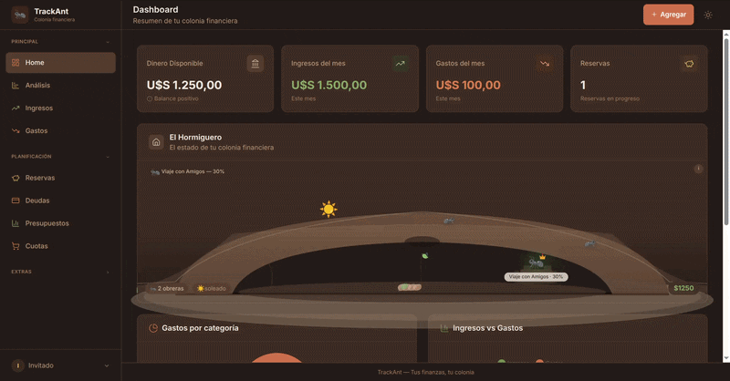
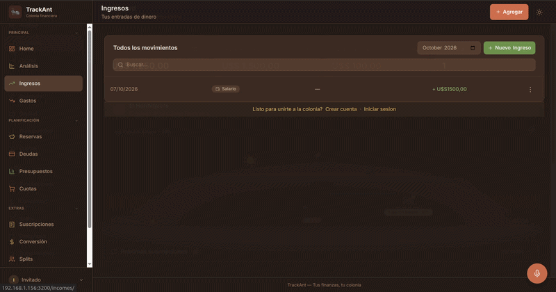

# 🐜 TrackAnt

> Your finances, your colony.


A local-first personal finance tracker built with **Django + HTMX + Alpine.js**,
wrapped in a playful ant-colony metaphor: your financial health drives a live,
animated colony. Multi-tenant, multi-currency, offline-capable PWA — no cloud
account required.

<!-- TODO: replace with the real dashboard + colony GIF -->


## Why it's interesting

- **Multi-tenant by design** — every model is scoped to a *Colony*. A custom
  middleware injects `request.colony`, so all queries are isolated without
  touching `request.user`. Anonymous visitors get a guest colony; registered
  users get their own.
- **Local-first** — runs entirely on SQLite (`~/.trackant/db.sqlite3`), works
  offline, no external services. Ships as a Docker image for self-hosting.
- **HTMX-driven UI** — server-rendered partials for CRUD, search (debounced
  500 ms), inline category creation and modals, with Alpine.js for local state.
- **REST API** — the same domain exposed through Django REST Framework
  (viewsets, filtering, search, ordering, pagination).
- **Real product surface** — auth, budgets with alerts, recurring
  subscriptions, shared expenses, installments, currency conversion with live
  rates, automatic backups, a PWA shell and dark mode.

## Features

**Core**
- Dashboard with KPIs, pie/bar charts, recent transactions and the colony widget
- Transactions CRUD with search, month filter and a quick-add modal
- Incomes & expenses, category management with Lucide icon/color picker
- **Analytics** — month-over-month deltas, spending by category, 12-month
  trend, budget progress, end-of-month projection and an *ant-expense* detector
- **Currency conversion** with API-sourced exchange rates

**Planning & tracking**
- **Reserves** — savings/investment buckets that don't count as available
  balance; optional targets with progress bars
- **Debts** — "I owe" / "owed to me" with payment history and auto-settlement
- **Budgets** — monthly limits per category with threshold alerts
- **Subscriptions** — weekly/monthly/yearly cycles with normalized monthly cost
- **Splits** — shared expense groups with per-member balances and payments
- **Installments** — installment purchases with generated schedules

**Experience**
- **Ant colony** — animated SVG that reflects financial health (weather,
  workers, queen, leaf pile)
- **PWA** — installable, offline via service worker, configurable bottom tab bar
- **Dark mode** — class-based toggle persisted in `localStorage`
- **Voice dictation** — describe a transaction out loud and it's parsed into
  amount, type, category and date
- **Multi-currency** and **Spanish (es-AR)** localization
- Mobile-aware inputs (`inputmode`) for the right on-screen keyboard

## Voice dictation

Log a transaction by speaking. Describe it in plain Spanish and TrackAnt fills
in the type, amount, category and date.

- **Web Speech API** for speech-to-text, triggered from a mic button in the
  quick-add modal and a floating action button.
- **Pure-JS natural-language parser** (`static/js/nl-parse.js`) — no AI/LLM,
  runs fully offline. Detects income vs. expense, parses amounts and relative
  dates ("ayer", "el lunes") and matches the category by name through a synonym
  map, using word-boundary matching where the longest term wins.
- **Graceful fallback** — parsed values pre-fill the form and remain editable,
  so dictation is a shortcut, never a lock-in.

<!-- TODO: replace with the dictation demo GIF / video -->
[]([VIDEO_LINK])

## Tech stack

| Layer | Technology |
|---|---|
| Backend | Django 5.0 |
| API | Django REST Framework |
| Filtering | django-filter, SearchFilter, OrderingFilter |
| Templates | Django templates, django-htmx, django-widget-tweaks, crispy-tailwind |
| Frontend | HTMX 2.0, Alpine.js 3.x, Tailwind CSS, Chart.js 4 |
| Icons | Lucide |
| Database | SQLite (local-first) |
| Media | Pillow |
| Dates | python-dateutil |
| Serving | Gunicorn + WhiteNoise |
| Packaging | Docker, GitHub Container Registry |

## Architecture

```
ColonyMiddleware ──► request.colony ──► filtered querysets (per request)
                                          │
        ┌─────────────────────────────────┼───────────────────────────────┐
        │                                 │                               │
   finances (Transaction, Category,    goals (Reserve)            debts · budgets
             Currency)                                             subscriptions · splits
                                                                   installments
```

Key patterns:
- **Tenant scoping** — `Model.objects.filter(colony=request.colony)` in every
  view/viewset; global reference data uses `Q(colony=c) | Q(colony__isnull=True)`.
- **Atomic updates** — `F()` expressions for balances to avoid race conditions.
- **Services & signals** — subscription payments and reserve progress are
  driven by service functions and `post_save` signals.
- **Decimal, never float** — all money uses `DecimalField`/`Decimal`.
- **Progressive enhancement** — HTMX partial swaps with full-page fallbacks;
  View Transitions API for smooth PWA navigation.

## REST API

Base path `/api/v1/` — paginated (25/page), filter/order/search on list
endpoints.

| Endpoint | Description |
|---|---|
| `currencies/`, `categories/`, `transactions/` | Core finance resources |
| `reserves/` | Savings buckets |
| `debts/`, `debt-payments/` | Debts and payments |
| `budgets/` | Monthly budgets |
| `subscriptions/`, `subscription-payments/` | Subscriptions (+ `toggle`) |
| `split-groups/`, `split-expenses/` | Shared expenses |
| `installments/` | Installment purchases |
| `stats/`, `stats/by-category/`, `stats/monthly/` | Aggregated stats |

## Getting started

### One command

```bash
git clone https://github.com/Felipe-258/TrackAnt.git
cd TrackAnt
./scripts/run.sh
```

Creates the venv, installs deps, migrates, seeds sample data and serves on
`http://localhost:8000`.

### Manual

```bash
python3 -m venv venv && source venv/bin/activate
pip install -r requirements.txt
python manage.py migrate
python manage.py seed_data       # 6 currencies + 21 categories (idempotent)
python manage.py runserver
```

### Docker

```bash
docker build -t trackant .
docker run -p 8000:8000 -v trackant-data:/root/.trackant trackant
```

## Testing

```bash
python manage.py test
```

Coverage across `finances`, `goals`, `splits` and `subscriptions` (models,
views and API behavior).

## Project structure

```
TrackAnt/
├── finances/       # Transactions, categories, currencies, dashboard, analytics
├── goals/          # Reserves / savings buckets
├── debts/          # Debts and payments
├── budgets/        # Monthly budgets
├── subscriptions/  # Recurring subscriptions
├── splits/         # Shared expenses
├── installments/   # Installment purchases
├── ants/           # Ant-colony visualization (views, tags, CSS)
├── users/          # Auth, colonies, settings, middleware
├── backups/        # DB backup management command
├── api/            # Central REST router + stats
├── templates/      # Global templates and components
├── static/         # Manifest, service worker, JS, CSS
└── scripts/        # run.sh, desktop launcher
```

## Engineering notes

- **Colony middleware** keeps tenancy out of every view signature.
- **Analytics** recomputes month deltas and projects spend from current pace.
- **Ant-expense detector** uses a hybrid threshold (absolute cap vs. % of
  income) plus a per-category frequency condition.
- **Voice dictation without AI** — a pure-JS parser (no LLM, offline) turns
  natural-language Spanish into a pre-filled transaction.
- **Mobile input UX** — explicit `inputmode` on numeric fields so phones show
  the right keyboard.
- **Design system** — Tailwind palettes `earth` (chrome), `clay` (expenses),
  `sage` (income), `gold` (reserves).

## Roadmap

- [ ] Public live demo
- [ ] CSV/OFX import
- [ ] Multi-user colonies with roles
- [ ] Native mobile shell

## License

MIT

## Author

Felipe Franco · [CV](https://drive.google.com/file/d/1vprjoQZr03xI_ueMxefor8CJ1Og7H_Ew/view?usp=sharing) · [GITHUB](https://github.com/Felipe-258) · [LINKEDIN](https://www.linkedin.com/in/felipe-franco-83960a234/) · francofelipee.25@gmail.com
